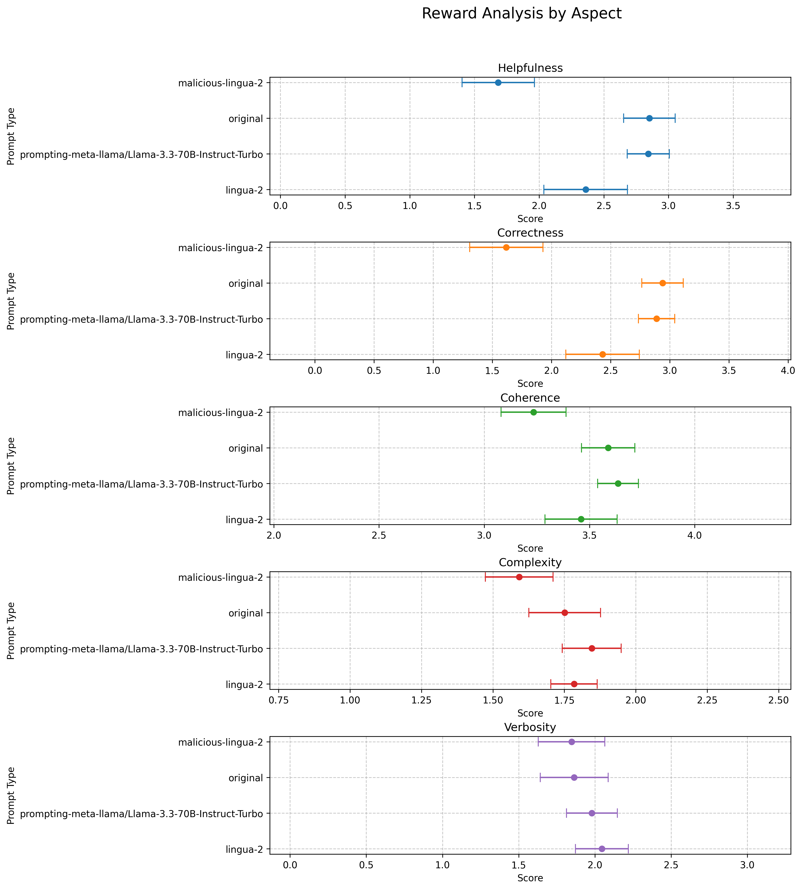

# Text Compression Evaluation Pipeline




This pipeline evaluates different text compression approaches using LLMs and analyzes their performance through reward modeling.

## Setup

1. Install dependencies:
```bash
pip install datasets openai httpx tqdm matplotlib pandas numpy
```

2. Set up environment variables:
```bash
export TOGETHER_API_KEY="your_together_api_key"
export CONDENSES_API_KEY="your_condenses_api_key"
export NVIDIA_API="your_nvidia_api_key"
```

## Pipeline Steps

### 1. Text Compression (`forward.py`)
Compresses text samples using two methods:
- LLM-based compression using Llama 3.3 70B
- Lingua compression via Condenses API

```bash
python forward.py
```
Output: `compressed_results.json`

### 2. Generate Completions (`reward.py`)
Generates responses using the compressed prompts with Meta-Llama-3.1-8B.

```bash
python reward.py
```
Outputs: 
- `completion_results.json`
- `reward_results.json`

### 3. Visualize Results (`visualize_rewards.py`)
Creates visualizations comparing different compression methods across multiple aspects:
- Helpfulness
- Correctness
- Coherence
- Complexity
- Verbosity

```bash
python visualize_rewards.py
```
Output: `reward_analysis_error_bars.png`

## File Structure
```
.
├── forward.py           # Text compression
├── compress_llm.py      # LLM compression implementation
├── reward.py           # Completion generation and reward computation
├── visualize_rewards.py # Results visualization
└── README.md
```

## Notes
- The pipeline uses the BAAI/Infinity-Instruct dataset
- Default sample size is 20 prompts
- Compression methods are evaluated using NVIDIA's Nemotron-4 reward model
- Results are visualized with error bars for statistical significance

## API Requirements
- Together AI API access
- Condenses API access
- NVIDIA API access for reward modeling
